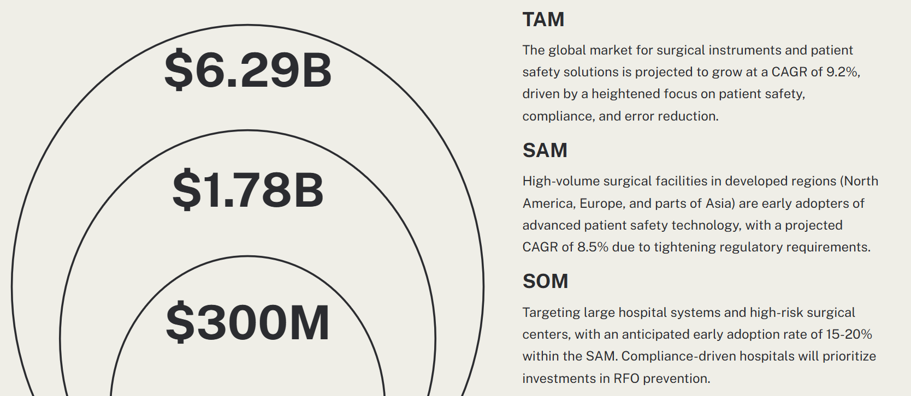

# SafeScan

Our IoT venture pitch was a product designed for hospitals, specifically surgery rooms, to detect and thereby reduce Retained Foreign Objects (RFOs). RFOs are medical instruments and equipment left behind in a patient after surgery, and can lead to severe consequences. Statistics reveal that an estimated 1,500 RFO cases occur annually in the US alone - this is exacerbated by the high-pressure environment of a surgery room, miscommunication, complexity of the surgery, and other factors that are a fixture of surgery rooms. Each RFO incident costs hospitals significant amounts in terms of medical expenses, legal liabilities, and reputational damage.

Our product is an RFID based system that is proposed to integrate seamlessly with most surgical workflows to keep track of all the medical instruments, and inform the surgery team if anything is unaccounted for. We intended to prototype a system of RFID readers and tagged medical instruments to keep track of the various categories of equipment that are used in a surgery room.

These RFID readers are intended to be placed under bins and trays that the hospital would already be using, and keep a record of the items present at the start of the surgery. When the surgery is over, if all the items have not been accounted for then the surgery team is alerted.

This can also function as a logistics management system, if scaled up - if we keep tabs on all the items that are connected to the RFID readers at any given instant, we can examine the patterns of disconnection and reconnection and understand the flow of equipment and materials, and possibly reduce bottlenecks and inefficiencies.

## Target Market and Demographics

The following graphic shows the estimated Total Addressable Market (TAM), Serviceable Addressable Market (SAM), and Serviceable Obtainable Market (SOM).

We expect to make the sales primarily to hospital administrators, and those managing logistics for large hospitals.

## Security, Hardware, and Software requirements

TODO: Add resolution of each requirement

### Security Requirements

- SEC01: The RFID tag information shall be immutable once programmed
- SEC02: The nRF7002DK shall authenticate only one RFID reader
- SEC03: The authentication shall run on ARM TrustZone
- SEC04: WiFi communication shall happen through certificate authentication.
- SEC05: The nRF7002 shall disallow programming firmware from an untrusted in-circuit emulator (ICE)

### Hardware Requirements

- HRS01: Each RFID reader shall be able to detect RFID tags within 5cm
- HRS02: Each RFID reader shall be able to detect at least 5 tags
- HRS03: The RFID tags shall use the 13.56MHz communication band
- HRS04: The RFID reader shall communicate with the Nordic nRF7002DK development kit
- HRS05: Each nRF7002DK shall be able to communicate wirelessly over WiFi to a dashboard
- HRS06: At least two nRF700DK development kits must be able to communicate wirelessly at the same time
- HRS07: The RFID platform shall use OTS components for the MVP - PN532 and MIFARE classic tags

### Software Requirements

- SRS01: Each nRF7002DK shall be uniquely identifiable in the analytics platform
- SRS02: The nRF7002DK shall periodically transmit the list of currently connected RFID tags over WiFi
- SRS03: The nRF7002DK shall use Zephyr RTOS
- SRS04: The nRF7002DK shall use the Memfault Device Reliability platform
- SRS05: The analytics platform shall be able to receive data from each nRF7002DK
- SRS06: The analytics platform shall not place any constraints on the number of RFID modules it can support
- SRS07: The analytics platform backend shall be able to receive the data coming in from the RFID platform into a codebase

## Product Function and Components

## Power & Cost Budgeting

# Parts of the project that were a success

# Parts of the project that didn't go well

# What we would do differently

# Would we change the system design