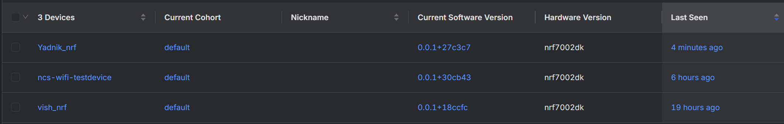
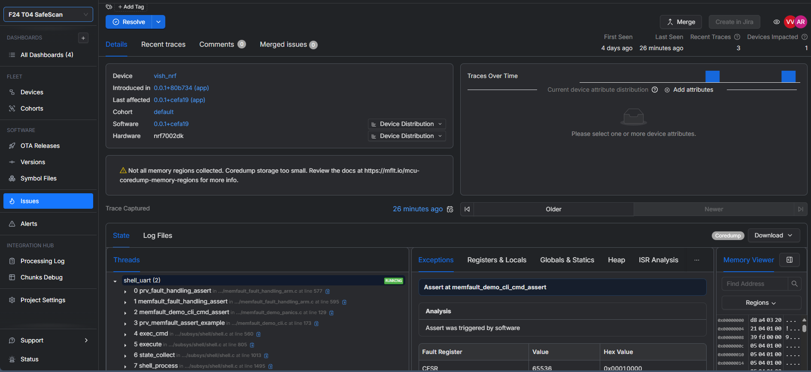
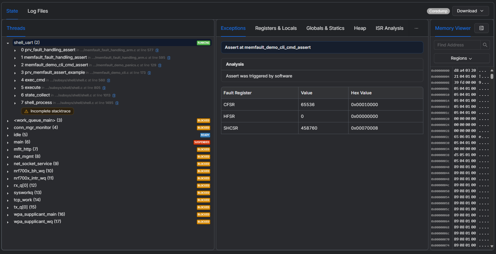
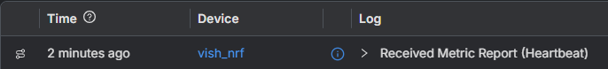
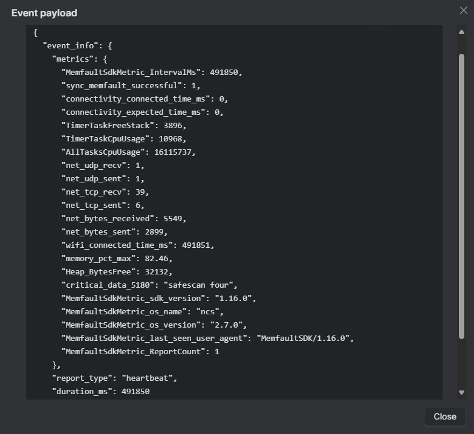
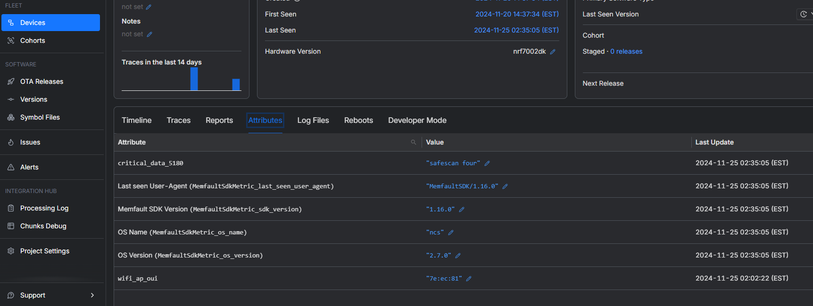
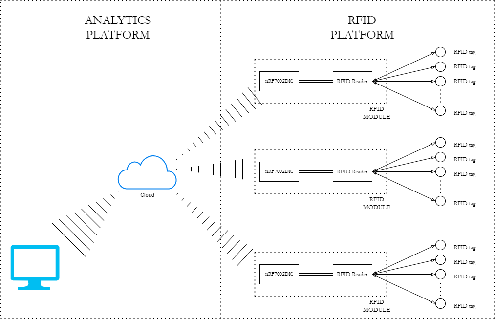
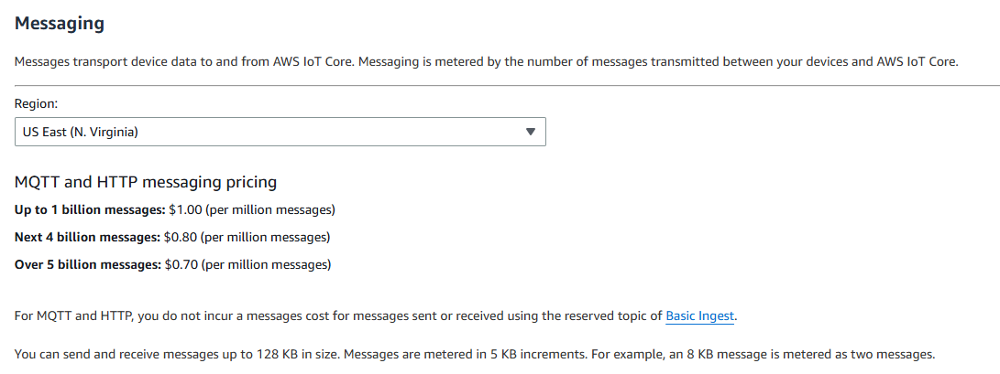

[](https://classroom.github.com/a/URrFMA27)

# GitHub URL

https://github.com/ese5180/fp-f24-iot-venture-pitch-clearstream

# Fleet Management

## Memfault working on two devices.

All three of us were able to flash a project on our devices.



## Coredumps

The process for this involved the following steps:
- Changing the device name in prj.conf
- Sending ```mflt test assert``` to the nRF7002DK
- Uploading the symbol file: ```build\zephyr\zephyr.elf```.

Then if we go to the Issues tab of the Memfault dashboard, and have uploaded the correct symbol file, we can see a coredump (which is essentially the memroy contents at the instant that the system failed).




## Metrics

The process for this involved the following steps:
- Adding this line to ```memfault_metrics_heartbeat_zephyr_port_config.def```:
```
MEMFAULT_METRICS_STRING_KEY_DEFINE(critical_data_5180, 32)
```
- Adding the following global definitions in main.c:
```
char strings[5][32] = {
	"safescan one",
	"safescan two",
	"safescan three",
	"safescan four",
	"safescan five"
};
int ctr = 0;
```
- Updating the main loop as so:
```
	while (1) {
		MEMFAULT_METRIC_SET_STRING(critical_data_5180, strings[ctr]);
		k_sleep(K_SECONDS(20));
		++ctr;
		if(ctr >= 5)
		{
			ctr = 0;
		}
	}
```
- Changing the new metric we created (```critical_data_5180```) into an attribute by going to Project Settings -> Metrics and clicking on the relevant metric and checking the "Attribute" checkbox.
- Running the ```mflt test heartbeat``` serial CLI command
- Running the ```mflt post_chunks``` serial CLI command
- At this point, we should see something like this in the processing log:

- Inspecting the event payload shows us that our data was indeed sent with the heartbeat report

- Since we marked this metric as an attribute, we can see this in Devices -> Attributes as well.



# FP-F24 IoT Venture Pitch

## ESE5180: IoT Wireless, Security, & Scaling

## 2 Team Selection

Team Name: SafeScan

| Team Member Name | Email Address           |
| ---------------- | ----------------------- |
| Nami Lindquist   | namil@wharton.upenn.edu |
| Yadnik Bendale   | ybendale@seas.upenn.edu |
| Vishnu Venkatesh | vishnuv@seas.upenn.edu  |

When will you have your 30-minute weekly team meeting?

- Friday at 8pm

## 3 Reading & Research

Nothing to submit for this section!

## 4 Concept Development

### 4.1 Target Market & Demographics

### 4.2 Security Requirements Specification

(Note: The requirements are for the MVP/proof-of-concept we plan to use to showcase the idea)

SEC01: The RFID tag information shall be immutable once programmed
SEC02: The nRF7002DK shall authenticate only one RFID reader
SEC03: The authentication shall run on ARM TrustZone
SEC04: WiFi communication shall happen through certificate authentication.
SEC05: The nRF7002 shall disallow programming firmware from an untrusted in-circuit emulator (ICE).

### 4.3 Hardware Requirements Specification

(Note 1: The requirements aren't for the market release product, but rather for the MVP/proof-of-concept we plan to use to showcase the idea.)
(Note 2: The footnotes explain the reasoning behind these requirements.)

HRS01: Each RFID reader shall be able to detect RFID tags within 5cm 
HRS02: Each RFID reader shall be able to detect at least 5 tags 
HRS03: The RFID tags shall use the 13.56MHz communication band 
HRS04: The RFID reader shall communicate with the Nordic nRF7002DK development kit 
HRS05: Each nRF7002DK shall be able to communicate wirelessly over WiFi to a dashboard 
HRS06: At least two nRF700DK development kits must be able to communicate wirelessly at the same time 
HRS07: The RFID platform shall use OTS components for the MVP - PN532 and MIFARE classic tags[^1].

### 4.4 Software Requirements Specification

(Note 1: The requirements aren't for the market release product, but rather for the MVP/proof-of-concept we plan to use to showcase the idea.) 
(Note 2: The footnotes explain the reasoning behind these requirements.)

SRS01: Each nRF7002DK shall be uniquely identifiable in the analytics platform 
SRS02: The nRF7002DK shall periodically transmit the list of currently connected RFID tags over WiFi 
SRS03: The nRF7002DK shall use Zephyr RTOS 
SRS04: The nRF7002DK shall use the Memfault Device Reliability platform 
SRS05: The analytics platform shall be able to receive data from each nRF7002DK 
SRS06: The analytics platform shall not place any constraints on the number of RFID modules it can support 
SRS07: The analytics platform backend shall be able to receive the data coming in from the RFID platform into a codebase[^2]

### 5.4 System Level Diagrams



### 4.6 Budgeting

**Power Budget**

Nordic nRF7002DK: 60mA 
PN532: 35mA

The PN532 has a digital supply current consumption of 25mA, but it can have spikes of 60-150mA during transmission - so 35mA is a safe estimate.

The total power budget is about 95mA at 3.3V, so that's 31.35mW.

**Hardware costs**

All we need for the MVP is 3 RFID readers and about 20 RFID tags. We can use OTS components because for the MVP we don't intend to innovate with RFIDs - as long as the interface remains the same we can always swap out the RFID platform for a higher end one.

[PN532 NFC/RFID controller breakout board - v1.6](https://www.adafruit.com/product/364): $40/unit x 2 units = $80 
[13.56MHz RFID/NFC White Tag - Classic 1K](https://www.adafruit.com/product/360): $2.50 x 10 units = $25

Total: $105.

If we have the budget, we'd like to get maybe 3 RFID controller breakouts ($120), bringing the total to $145. Scaling up shouldn't be a problem because we intend to have everything running the same firmware.

**Software costs**

We will need an AWS-IoT subscription. The prices are shown below.



If we send one JSON object every half a minute (it will be less than 128KB for sure), the number of messages a year is 2 * 60 * 24 * 365 = 1,051,200. That's about $1 a year.

## 5 In-Class Pitch

Your 7-minute pitch must include:

* Target Market & Demographics
* System block diagram

If you plan to use slides, photos, or video content, you must add it to
[this Google Slides presentation](https://docs.google.com/presentation/d/1y8u7Vnv6UbQW1ZJE-_bTKOHY9EkHA-aqm6LmBllAFdA/edit#slide=id.p1).

[^1]: These are non-industrial grade RFID products. For the final product, we can use vicinity RFID tags (which have higher range and conform to ISO-15693) instead of proximity RFID tags (which have lower range and conform to ISO-14443), and a dedicated RFID antenna and controller. But since the focus of this part of the project is on the IoT side of things (namely, the Analytics platform) we intend to come up with a minimum viable RFID platform probably using the Arduino IDE and prototype OTS components - as long as it communicates to the Analytics platform with the intended interface, it can always be swapped in for higher-end RFID systems.
    
[^2]: The idea is to have a flexible backend that we can program. We want a backend more powerful than Node-RED, for example, because that is pretty much just a visualization tool - we want to be able to process the data we receive from the RFID platform (which is a list of RFID modules and the tags that are currently connected, in regular intervals) in a language slightly more powerful than JavaScript and more suited to data analytics. Python, perhaps. So if we have the ability to "receive" all the data that can be extracted with this architecture into a Python program running on a VM in the cloud, we can do any innovation we might want to do in analytics with software. And we can worry about the frontend once the backend is set - for now, a simple web server in Flask might be able to do the trick.
